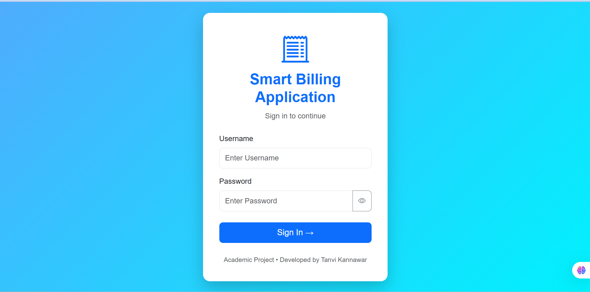
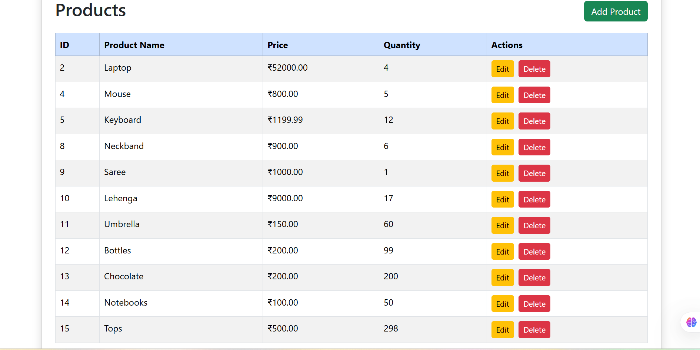
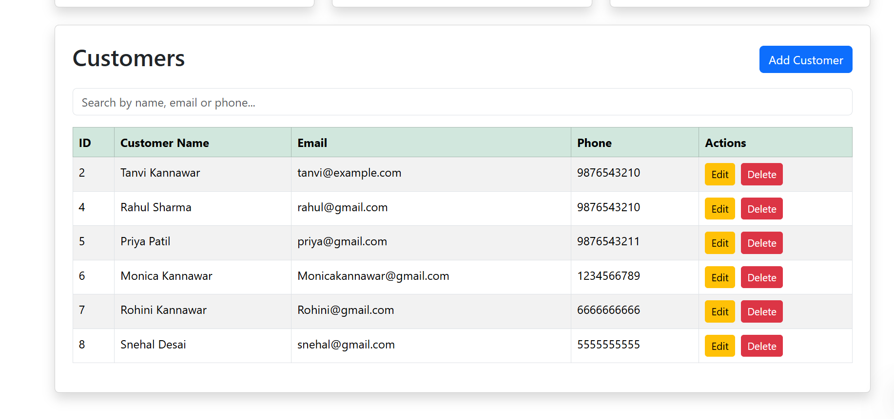
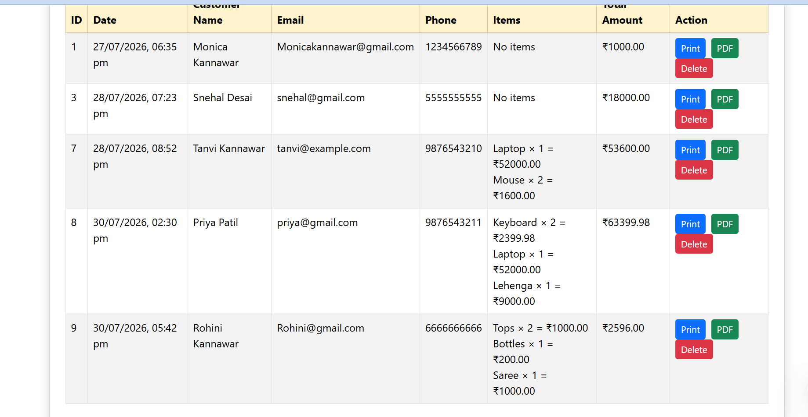
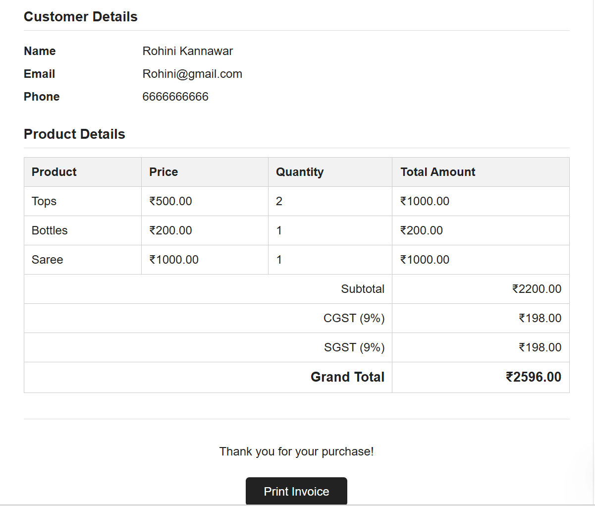

# 🧾 Smart Billing Application

A full-stack Smart Billing Application developed using Spring Boot, MySQL, HTML, CSS, JavaScript, and Bootstrap.

The application helps manage products, customers, invoices, inventory, GST calculations, billing, and invoice reports efficiently.

---

## 📌 Features

### 🔐 Authentication

- Admin login
- Session-based authentication
- Logout functionality
- Protected dashboard access

### 📦 Product Management

- Add products
- View all products
- Search products
- Update products
- Delete products
- Manage product stock

### 👥 Customer Management

- Add customers
- View all customers
- Search customers
- Update customer details
- Delete customers

### 🧾 Invoice Management

- Create invoices
- Add multiple products to one invoice
- Automatic bill calculation
- Automatic GST calculation
- View invoice history
- Search invoices
- Delete invoices
- Automatic stock reduction after invoice creation
- Automatic stock restoration after invoice deletion

### 📄 Invoice Reports

- Print invoices
- Download invoices as PDF
- Display subtotal, CGST, SGST, and grand total

### 📊 Dashboard

- Total products
- Total customers
- Total invoices
- Total revenue

### ⚠️ Exception Handling

- Customer not found
- Product not found
- Invalid quantity
- Insufficient stock
- Validation errors

---

## 🛠 Technologies Used

### Backend

- Java 21
- Spring Boot 3.5.4
- Spring Web
- Spring MVC
- Spring Data JPA
- Hibernate
- Maven

### Frontend

- HTML
- CSS
- JavaScript
- Bootstrap

### Database

- MySQL

### API Documentation and Testing

- Swagger OpenAPI
- Postman
- Thunder Client

### Development Tools

- Visual Studio Code
- Git
- GitHub

---

## 📁 Project Structure

```text
smartbilling
│
├── screenshots
│   ├── login.png
│   ├── dashboard.png
│   ├── products.png
│   ├── customers.png
│   ├── invoice.png
│   └── pdf.png
│
├── src
│   ├── main
│   │   ├── java
│   │   │   └── com
│   │   │       └── tanvi
│   │   │           └── smartbilling
│   │   │               └── smartbilling
│   │   │                   ├── config
│   │   │                   ├── controller
│   │   │                   ├── dto
│   │   │                   ├── entity
│   │   │                   ├── exception
│   │   │                   ├── repository
│   │   │                   └── service
│   │   │
│   │   └── resources
│   │       ├── static
│   │       │   ├── css
│   │       │   ├── js
│   │       │   ├── index.html
│   │       │   ├── login.html
│   │       │   ├── login.css
│   │       │   └── login.js
│   │       │
│   │       └── application.properties
│   │
│   └── test
│
├── smartbilling.sql
├── pom.xml
├── mvnw
├── mvnw.cmd
└── README.md
```

---

## 🗄️ Database Setup

The application uses a MySQL database named:

```text
smartbilling
```

Import the following SQL file into MySQL:

```text
smartbilling.sql
```

You can import it using MySQL Workbench:

1. Open MySQL Workbench.
2. Connect to your MySQL server.
3. Open `smartbilling.sql`.
4. Execute the SQL script.

---

## ⚙️ Application Configuration

Open:

```text
src/main/resources/application.properties
```

Configure your MySQL details:

```properties
spring.datasource.url=jdbc:mysql://localhost:3306/smartbilling
spring.datasource.username=your_mysql_username
spring.datasource.password=your_mysql_password

spring.jpa.hibernate.ddl-auto=update
spring.jpa.show-sql=true
```

Do not upload your actual MySQL password to a public GitHub repository.

---

## 🚀 How to Run the Application

### 1. Clone the repository

```bash
git clone https://github.com/tanvikannawar/smart-billing-application.git
```

### 2. Open the project folder

```bash
cd smart-billing-application
```

### 3. Configure the database

Create the `smartbilling` database and update `application.properties` with your MySQL credentials.

### 4. Run the application on Windows

```bash
.\mvnw.cmd spring-boot:run
```

You can also run:

```bash
mvn spring-boot:run
```

### 5. Open the application

```text
http://localhost:8080
```

---

## 🔑 Login Credentials

```text
Username: admin
Password: admin123
```

---

## 📚 API Documentation

Swagger UI is integrated into the project.

After starting the application, open:

```text
http://localhost:8080/swagger-ui/index.html
```

---

## 🔗 REST API Endpoints

### Product APIs

```text
POST   /api/products
GET    /api/products
GET    /api/products/{id}
PUT    /api/products/{id}
DELETE /api/products/{id}
```

### Customer APIs

```text
POST   /api/customers
GET    /api/customers
GET    /api/customers/{id}
PUT    /api/customers/{id}
DELETE /api/customers/{id}
```

### Invoice APIs

```text
POST   /api/invoices
GET    /api/invoices
GET    /api/invoices/{id}
PUT    /api/invoices/{id}
DELETE /api/invoices/{id}
```

---

## 📷 Screenshots

### Login Page



### Dashboard


### Product Management



### Customer Management



### Invoice Generation



### Invoice PDF



---

## 📈 Future Enhancements

- Role-based authentication
- Secure password encryption
- Email invoice functionality
- Barcode scanner integration
- Advanced sales reports
- Charts and analytics
- Multi-user support
- Cloud deployment
- Online payment integration
- Product category management

---

## 👩‍💻 Developer

**Tanvi Kannawar**

Final Year Information Technology Student

GitHub: [tanvikannawar](https://github.com/tanvikannawar)

---

## ⭐ Support

If you find this project useful, please give the repository a star.